<p align="center">
  
</p>

<p align="center">
  <a href="https://readme-typing-svg.demolab.com">
    
  </a>
</p>

<p align="center">
  
</p>

---

Ich entwickle mit Schwerpunkt **C# / .NET** und führe heute das Team, in dem ich
meine eigene Ausbildung gemacht habe. Vom ersten Commit zum Teamleiter und
Ausbilder in unter fünf Jahren – und ich bilde selbst die nächste Generation aus.

```csharp
var elias = new Entwickler
{
    Rolle     = "Teamleiter & Ausbilder",
    Firma     = "on-geo GmbH",
    Stack     = [".NET", "Blazor", "Angular", "React"],
    Fokus     = ["Clean Architecture", "CI/CD", "Mentoring"],
    Azubis    = 5,
    CleanCode = true,
};
```

### 🛠️ Tech-Stack


### 🐍 Aktivität

<p align="center">
  
</p>

<p align="center">
  
</p>

### 📊 Stats

<p align="center">
  
  
</p>

### 📫 Kontakt

[](https://eliasregber.de)
[](https://www.linkedin.com/in/elias-constantin-regber-aa7513261/)
[](mailto:mail@eliasregber.de)

<p align="center"><sub>Mein Profil ist auch eine begehbare IDE → <a href="https://eliasregber.de">eliasregber.de</a></sub></p>
